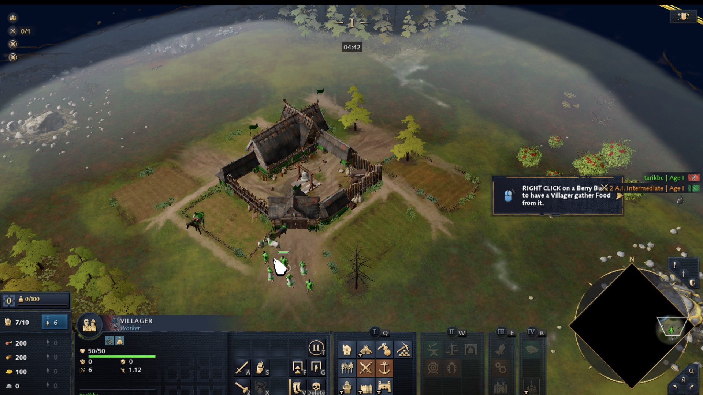

# Age of Empires IV on the AYN Thor (GameNative 1.2.1)

Running AoE IV on an Android handheld with [GameNative](https://github.com/utkarshdalal/GameNative).
Device: AYN Thor (Snapdragon 8 Gen 2, Adreno 740, 16 GB, Android 13). Game build 16.3.11308.

**Goal:** the game's copy protection, **Aegis** (Relic's in-house virtualization/anti-tamper), stopped the
game 2–4.5 minutes in (until 2026-10-07, see the status below). The user owns the game, so the aim is to make the protection *accept* this
environment — not to strip it out.

## Status: it runs (2026-10-07)

AoE IV runs on the Thor and can be played, with the Thor's controls, past the points where the protection used to
stop it.

| | |
|---|---|
|  |  |
| Main menu, on screen at the first check, 2 min 43 s after the game process appeared | The game's controller UI (tutorial mission) |
|  |  |
| Skirmish with mouse UI, 15 minutes after launch | Match with the controller UI, 15 minutes after launch |

**Validated runs:**

- 09:27, job build `08172f64` (the patches below plus analysis code): watched for 1,514 s, the log last grew at
  1,456 s; a Skirmish was being played 15 minutes in. The protection's loop cycle averaged about 1.1 s (10-cycle means
  0.6 to 2.0 s) and its watchdog bucket was 0 at every check up to 1,469 s ([FAST-CONTINUE.md](docs/FAST-CONTINUE.md)).
- 10:00, the exact repo patch set, build `86d6da39`: 8,200 continues/s took the fast path and 0 the slow one; past
  15 minutes (917 s) the log was still growing and a match was being played with the controller UI.

**What it takes (as tested):**

1. GameNative 1.2.1 container: Wine `proton-11.0-99-arm64ec-1`, variant `bionic`, 64-bit emulator FEXCore.
2. FEX `7d3090f` with [patches](patches/fex) 0002, 0004, 0006, 0007, 0009 and 0010 ([BUILDING-FEX.md](docs/BUILDING-FEX.md)).
3. That `libarm64ecfex.dll` installed as `C:\windows\system32\libarm64ecfex.dll` from an "Open container"
   session (rename the old file aside, then copy; `tools/ab_fex.py` does both). The FEXCore Version selected in
   the Emulation tab must not ship a `libarm64ecfex.dll`, or GameNative writes its own over it at every start
   ([GAMENATIVE-UI.md](docs/GAMENATIVE-UI.md)); these runs used `ntdll-waitq-fix-1`, a local content that ships
   only an `ntdll.dll`.
4. Container `envVars`: `FEX_EXP_FASTCONTINUE=1 FEX_EXP_SKIP_CALLRET_RESET=1`, and `WINEDEBUG=-all`.
5. For the controls: the Thor's controller set to Xbox style (Thor settings), and in the game Settings, Controls,
   input set to Gamepad. In the tested run the game then quit by itself (log: `Requesting game quit with reason:
   Contrast Change`), and it had to be started again from GameNative.

**Known limits:**

- Speed: the user estimated about 20 FPS in a match. Measured at the same time: the GPU 56 to 68 % busy at
  401 of 680 MHz, and the game's main thread on a CPU 0.66 s per second while it blocked about 3,600 times per
  second (not on wineserver: 32 sync wake-ups/s). GameNative's power profile caps the CPU during a game
  (cores 3 to 6 at 2.05 of 2.80 GHz, core 7 at 1.98 of 3.19 GHz).
- Patch 0009 is unsafe in general; a run without it has not been made yet.
- The FEX DLL is installed by hand, see step 3.

## How we got here

- **The game runs and is playable (2026-10-07, 09:42).** With FEX patches 0007, 0009 and 0010
  (`FEX_EXP_FASTCONTINUE=1`), the main menu was on screen 2 min 43 s after the game process appeared, and a
  Skirmish against the AI was being played 15 minutes in ([screenshot](docs/img/skirmish-15min-2026-10-07.jpg)),
  past the point where every earlier run froze. The protection's loop cycle fell from about 2.6 to 3.2 s to about
  1.1 s and its watchdog bucket stayed at 0. The cause was one wineserver round trip per handled exception in
  Wine's ARM64EC `NtContinue` path; 0010 resumes x64 code without it. See [FAST-CONTINUE.md](docs/FAST-CONTINUE.md).

- **The kill is measured on a clean baseline.** With `WINEDEBUG=-all` the game loads its menu world in under
  three minutes. Then, 2 min 3 s to 3 min 2 s after start, every thread but one goes to Windows suspend
  count 1 and the log never grows again. That happened in 8 of the 9 runs that got past start-up today; the
  ninth (a control build) exited instead. The thread that does it starts at `RelicCardinal.exe+0x3e69304`.
  See [KILL-REMEASURED.md](docs/KILL-REMEASURED.md) and [SMC-TRAP-HIDDEN.md](docs/SMC-TRAP-HIDDEN.md).
- **The evening runs (19:52 to 20:29) were slowed by leftover debug channels.** The container still had
  `WINEDEBUG=+thread,+sync,+virtual,+timestamp,+tid` from round 17. With it, a run stopped in
  `Property Bag Manager`; without it, the same step took 22 s. The "MapGen wall" was a misreading: that
  message appears in every run that gets further. See [WINEDEBUG-LEFTOVER.md](docs/WINEDEBUG-LEFTOVER.md).
- **The SMC trap is not the trigger.** FEX does leak its write trap to the guest
  ([SMC-CONFIRMED.md](docs/SMC-CONFIRMED.md)), but a FEX build that hides it (patch 0004, verified with
  `smctest2`) was still killed in 5 of 5 runs. Inside the game, 732,206 memory queries passed the filter
  and none touched a trapped page. See [SMC-TRAP-HIDDEN.md](docs/SMC-TRAP-HIDDEN.md).
- **The session drop is not the trigger either.** Two runs had no `errno=10038` and were killed on time.
- **The kill is a timed job (2026-10-07).** Traced with `WINEDEBUG=+seh`: the kill thread's wait ends by timeout
  (`STATUS_TIMEOUT`) after 200.7 s, and its job then enters the suspend-all function. Two sibling threads run
  other jobs after 8.9 s and 98 s. See [KILL-TIMER.md](docs/KILL-TIMER.md).
- **x86-64 Wine under Box64 now gets through start-up (2026-10-07)** with two new Box64 patches, and stops in
  `Config File` after the protection's hook check reports a mismatch. See [BOX64-ROUTE.md](docs/BOX64-ROUTE.md).
- **Fixing the raw-syscall return registers does not stop the kill (2026-10-07).** On the Thor a raw x64 `syscall` returns
  `rcx` = status instead of the return address. FEX patch 0006 fixes that (verified with `syscallregs`), and
  the game still stopped in 3 of 3 runs. See [SYSCALL-RETURN.md](docs/SYSCALL-RETURN.md).
- **The start-up kill decision is an API hook check that fails only under ARM64EC Wine (2026-10-07).** The game
  checks 63 API functions for inline hooks; Wine's ARM64EC kernel32 exports 27 of them as bare `jmp [rip+x]`
  (`FF 25`) thunks, which the detector flags (x86-64 Wine adds a hot-patch prolog). FEX patch 0007 rewrites such
  thunks to `48 FF 25`. With it no record is flagged, start-up takes the Box64 branch, and two judged runs got past
  the old kill window with the log growing (to 479 s and 537 s). Both were still stopped later, 8 to 10 minutes in,
  by a decision on a protection worker thread. Found by dumping the decrypted code FEX compiles (patch 0008). See
  [HOOK-CHECK.md](docs/HOOK-CHECK.md).
- **The later stop is a watchdog on the protection's own loop (2026-10-07).** Each cycle of that loop may take
  2000 ms; the excess accumulates, and above 256 s the protection fails. On the Thor a cycle takes 2.2 to 5.8 s
  (mean 4.3 s), so it overflows after about 8.5 minutes; replaying the formula over the measured cycles hits the
  limit in the cycle where the failing check ran. About 40 % of that thread's time is FEX recompiling the
  protection's decrypt-on-demand code (2,267 compiles/s, 2,085 SMC events/s) and handling exceptions. See
  [WATCHDOG.md](docs/WATCHDOG.md).
- **First menu reached (2026-10-07, 07:37).** With FEX patches 0007 and 0009 (skip the per-thread call-ret discard on
  each SMC fault, an unsafe experiment), the game finished loading (`OnEndLoad` at 509 s) and drew its first-run
  Accessibility Settings screen on the Thor. The watchdog bucket still overflowed at about 793 s and the game froze
  about 13 minutes in. See [WATCHDOG.md](docs/WATCHDOG.md).

Read [docs/EXPERIMENTS.md](docs/EXPERIMENTS.md) first: it is the ledger of what was tried and what
happened, including the traps that produced wrong conclusions.

## The only success criterion

> The game's own log (`warnings.log`) is still growing **after ~5 minutes.**

"The process is still alive" is **not** success. The kill *suspends* every thread and leaves the process
hung, so `ps` keeps showing it and the log goes silent. Verified repeatedly.

## Verified facts

1. **The protection is Aegis.** Its build log is in the game folder (`Aegis_RelicCardinal.log`),
   referencing `Foreign/Aegis/Retail/internal/BlockList.json`; it ships a **386-item blocklist**.
2. **The kill:** a launch-time thread, entry `RelicCardinal.exe+0x3e69304`, whose function spans
   `+0x3e6b53c..+0x3e6cd0c`. It suspends all other threads via two indirect `SuspendThread` sites
   (`+0x49065a1`, `+0x490699d`), then spins at 100 % CPU. Its region `0x3e40000..0x3f90000` holds 1561
   registered functions.
3. **FEX advertised itself** — CPUID leaf `0x40000000` returned vendor `FEXIFEXIEMU`. Patched and
   verified live (`eax=0x0 vendor=''`). **The kill still fires.**
4. **The ntdll patches have never run.** Wine loads ntdll from *its own tree*, not
   `C:\windows\system32`. The mapped ntdll is pristine. This voids the earlier "patched ntdll" result.
5. **The game's backend session dies** (`TlsConnection::Shutdown errno=10038` → status `1006`), and the
   kill lands ~73 s later — but a run with a **healthy session throughout still died**. Correlational.
6. **`12152`/`12157` are noise.** They are Xbox Live (XAL) calls, downstream of the asio failure; the
   endpoints answer `200` from Wine.
7. **The kill's log tail is an `RtlWakeAddressAll` storm** — the Wine spinlock pathology
   `patches/proton-arm64ec-ntdll/waitq_fix.s` exists to fix, which has never been loaded.
8. **Wine TLS to the AoE backend is slow** (5–19 s vs 0.94 s native). `CertificateRevocation=0` fixes
   the timing, not the kill.

## Open hypotheses, best first

**Superseded (2026-10-07):** the two decisions that stopped the game were found and fixed: the start-up hook check
([HOOK-CHECK.md](docs/HOOK-CHECK.md), patch 0007) and the watchdog on the protection's loop
([WATCHDOG.md](docs/WATCHDOG.md), [FAST-CONTINUE.md](docs/FAST-CONTINUE.md), patch 0010). None of the hypotheses
below was needed to run the game; they stay as notes and were not tested further.

1. **Aegis hashes a memory region and compares it to an expected value.** Most likely `ntdll.dll`, whose
   bytes differ between Wine's ARM64EC build (Thor) and its x86-64 build (Mac/Rosetta) — which is
   exactly where the behaviour differs. **Located:** Aegis carries its own xxHash implementation at RVA
   `0x3e42d34` (plus siblings `0x3e563cc`, `0x3e681cc`, …), each with exactly one caller — and
   `0x3e681cc` is called from `0x3e68e3f`, ~1.2 KB before the kill thread entry `0x3e69304`. The calls
   pass a fixed 192-byte high-entropy blob at RVA `0x56fbf40`. See
   [KILL-ANALYSIS.md](docs/KILL-ANALYSIS.md).
   *Test:* resolve the parameter flow (Ghidra) to recover the hashed range and the expected hash.
2. **~~FEX leaks its self-modifying-code trap to the guest, and Aegis checks for exactly that.~~ Ruled
   out 2026-10-06** ([SMC-TRAP-HIDDEN.md](docs/SMC-TRAP-HIDDEN.md)): with the trap hidden the kill still
   fires (5 of 5), and no in-game query ever touched a trapped page. Original text kept below.
   **FEX leaks its self-modifying-code trap to the guest, and Aegis checks for exactly that.**
   Under `SMCChecks=mtrack`, FEX re-protects the guest's RWX pages to `PAGE_EXECUTE_READ` to trap writes
   (`InvalidationTracker::GetTrapProt`), and it does **not** intercept the guest's
   `NtQueryVirtualMemory` — so the guest is told its own code page is read-only when it set it
   read-write. Aegis calls `NtQueryVirtualMemory` **35,248 times per run**. This explains the kill's
   indifference to everything environmental, the exact `SMCChecks` sensitivity (`none` → no trap but no
   invalidation → exits at 2 min; `full` → stops at start-up with the trap still armed, re-measured in
   [KILL-REMEASURED.md](docs/KILL-REMEASURED.md)), why the Mac passes, and why
   byte-comparing probes saw a stable image (it is a *protection* change). **Fix:** intercept
   `NtQueryVirtualMemory` and report the untrapped protection. See
   [SMC-HYPOTHESIS.md](docs/SMC-HYPOTHESIS.md).
3. **A Wine API returns something Windows would not.** One concrete instance:
   `NtSetInformationThread(ThreadHideFromDebugger)` returns `0xC0000002` where Windows returns success —
   a plausible dependency of Aegis's "Stealth-Startup". *Test:* fix it in Wine's unix-side `ntdll.so`
   (the PE export is a bare syscall stub).

## Next actions

0. **Run without patch 0009** (`FEX_EXP_SKIP_CALLRET_RESET=1` removed). 0009 can leave a return prediction into old
   code; with 0010 the loop may be fast enough without it.
1. **Speed.** Try GameNative's in-game power profile (Performance) against the CPU caps above, and find what the
   main thread's 3,600 blocks per second wait for (FEX locks or the game's own job system).
2. **Install without hand work.** Ship the patched `libarm64ecfex.dll` as a FEXCore `.wcp` so GameNative installs
   it itself, and turn 0010 on without an environment variable. Not built or tested yet.
3. **Try GameNative's Proton 11.0-2.** The wineserver round trip that 0010 avoids came from a work-in-progress
   patch in GameNative/proton-wine that was reverted on 2026-07-17; Proton 11.0-2 (2026-09-28) no longer has it
   ([FAST-CONTINUE.md](docs/FAST-CONTINUE.md)). With 11.0-2, 0010 may be unnecessary. Its profile asks for a fresh
   ARM64EC container, so test it in a second container.

Earlier open questions (x86-64 Wine under Box64, the kill job's 150 ms call, the xxHash callers,
`ThreadHideFromDebugger`, the waitq ntdll) are no longer needed to run the game; see
[BOX64-ROUTE.md](docs/BOX64-ROUTE.md), [KILL-TIMER.md](docs/KILL-TIMER.md), [KILL-ANALYSIS.md](docs/KILL-ANALYSIS.md)
and [WINE-GAPS.md](docs/WINE-GAPS.md).

## Traps (each cost real time)

- **Alive ≠ working.** See the criterion above.
- **`text.bin` is indexed by `RVA - 0x1000`**, not RVA. Use `RelicCardinal.unpacked.exe` (restored
  `.text`); the on-disk `.exe` is still packed.
- **`uiautomator dump` alone lies here** — use `uiautomator dump --windows`.
- **GameNative manages the Wine version and FEXCore content itself.** Editing `wineVersion` in the
  container config is silently ignored; `envVars` *is* honoured.
- **Anything relying on "the patched ntdll" is void** — it was never loaded.
- **`C06T13R-1X-*` is server connectivity**, not file integrity, and does not prevent playing.
- **Debug channels left in the container config slow every later run.** Check
  `findstr /c:"WINEDEBUG" "Z:\home\xuser\.container"` before any judged run
  ([WINEDEBUG-LEFTOVER.md](docs/WINEDEBUG-LEFTOVER.md)).
- **Find the game by process NAME.** `explorer.exe` and `winhandler.exe` carry the game's path in their
  arguments, and a match on arguments picks `explorer` first.
- **A modal "unable to determine your video card's installed driver version" dialog** stops loading at
  `Loading step: [Graphics driver check]` once its one-day "Don't show this message" choice has expired
  (seen 2026-10-07 from 01:39). The kill still comes on time. GameNative's touch input cannot reach the button;
  `tools/probes/dlgclick` clicks it, and `run_watch.py` starts it in every run.
- **`tctx` suspends the thread it reads**, and it can hang there, leaving the thread at suspend count 1.
  Use `suspinfo` (no suspend) to judge a kill.

## Setup that works

| Part | Value |
|---|---|
| Wine | `proton-11.0-99-arm64ec` |
| CPU emulator | FEXCore; container variant `bionic` |
| FEX DLL in use | `C:\windows\system32\libarm64ecfex.dll` built from FEX `7d3090f` + patches 0002, 0004, 0006, 0007, 0009, 0010 (SHA-1 `86d6da39`, installed by hand 2026-10-07). The selected FEXCore Version, `ntdll-waitq-fix-1`, installs only an `ntdll.dll`, so GameNative leaves this file alone |
| FEX switches | `FEX_EXP_FASTCONTINUE=1 FEX_EXP_SKIP_CALLRET_RESET=1` in the container `envVars` |
| DX wrapper | VKD3D (vkd3d-proton 2.14.1 + DXVK 2.4.1-gplasync) |
| GPU driver | Turnip v26.2.0 R4 |
| Executable | `RelicCardinal.exe` (set by hand after import) |
| Wine debug | `WINEDEBUG=-all` in `envVars` (set 2026-10-06 20:49). The session started from it does not define `WINEDEBUG` at all (read with `set` at 21:10), so no trace channels are on |

**Debug output slows the game.** Turn it off in Settings → Debug, in the container Environment tab, and
note Bionic Steam copies Settings channels into `WINEDEBUG` even when the switch is off.

## Tools that work over ADB

- **Run a Windows program in the live session:** `winhandler.exe` on UDP `127.0.0.1:7946`.
  [`tools/winhandler_exec.py`](tools/winhandler_exec.py) builds the packet. `cmd` + `/c D:\x.bat`
  (program + params must stay ≤ 51 bytes, so wrap in a `.bat`).
- **Open container** (cog → assistant panel) starts `explorer` + `winhandler` in ~30 s **with no game**.
  This is the fast path for probes and config work.
- **Drives:** `D:` = `/sdcard/Download`. Wine trees are `Z:\opt\<wine-name>` (**read-only**).
- **Container config:** `Z:\home\xuser\.container` — editable from inside Wine; `envVars` is honoured.
- **Per-game FEX settings:** `Z:\home\xuser\.fex-emu\AppConfig\RelicCardinal.exe.json`.
- **Emulator DLL name:** set by `HKLM\Software\Microsoft\Wow64\amd64`.
- **Before committing any log or run output:** `python3 tools/redact.py --check samples docs` must report
  nothing. Game logs carry the Steam name, SteamID64, Relic profile ID and session tokens;
  `tools/redact.py samples` replaces them with placeholders.
- **Compare FEX builds:** [`tools/ab_fex.py`](tools/ab_fex.py) installs each build in turn (rename trick,
  hash checked) and judges a run on each. [`tools/smctest2.c`](tools/smctest2.c) shows whether the SMC trap
  is visible and still catching rewrites; [`tools/probes/fexstats.c`](tools/probes/fexstats.c) reads patch
  0004's counters from a live process.
- **Judge a run:** [`tools/run_watch.py`](tools/run_watch.py) `--launch` restarts GameNative, taps Play
  (and restarts the app if no game process appears within 90 s, for the "Syncing cloud saves" hang),
  copies `warnings.log` every 10 s and runs `suspinfo` every 20 s through
  [`tools/thor/mon.bat`](tools/thor/mon.bat) (push it to `D:\mon.bat`), and writes a timeline.
- **Probes:** [`tools/probes`](tools/probes) (`build.sh` builds all), each writing to `D:\` — `tctx`,
  `tstack`, `suspinfo`, `waitq`, `stk`, `stkscan`, `vq`, `vmmap`, `netprobe`, `selfchk`, `syscallregs`
  (registers after a raw `syscall`), `aegistrace` (copies the trace build's buffer out of the game),
  `waitexit` (exit code and final log when the game exits; `run_watch.py` starts it), `dlgclick` (clicks a
  dialog button by text; `run_watch.py` starts it for the driver-version dialog), `memwatch` (logs every
  change in a memory range of the game, with times), `peek` (hex dump of a range of the game's memory),
  `blkread` (copies patch 0008's block dump out of the game; `tools/blkparse.py` and `tools/blkmem.py` read it),
  `stkdump` (one thread's whole stack, for stale return addresses), `thunkprobe` (run as `RelicCardinal.exe`:
  counts the thunks patch 0007 rewrote), `cleancopy` (compares loaded system DLL exports with a fresh image
  mapping), `exccost` (time of one handled exception, as the protection uses them), `affin` (lists a process's threads with start address, CPU time and affinity; can pin the threads that start at one address), `modbase` (base address of one module in a process, for `peek` at a FEX global), `xinputprobe` (which XInput pads Wine sees; on 2026-10-07 it saw pad 0 connected. Its state log showed no change in two windows where it is not known whether the controls were used). `tools/dettable.py` decodes a `peek` dump of the hook-check table.
- **When the game exits instead of freezing, GameNative closes the container at once** (logcat: `Exit called:
  processes_exited` 34 ms after the game's window went away), so the 10 s log copies miss the end. `waitexit`
  copies the log at that moment. The game also keeps one `LogFiles\unhandled.<start time>.txt` per run
  (49 read on 2026-10-07: lag, network and login-throttling warnings only).
- **Syscall numbers:** [`tools/ntdll_syscall_table.py`](tools/ntdll_syscall_table.py) decodes them from an
  ntdll's own stubs; the device's differ from upstream Wine ([WINE-SOURCE.md](docs/WINE-SOURCE.md)).

## Patches in this repo

| Path | What it is |
|---|---|
| [`patches/fex/`](patches/fex) | 0002 hides the CPUID vendor; 0004 hides the SMC trap from guest queries (works; does not stop the kill); 0006 makes a raw x64 `syscall` return registers like hardware (works; does not stop the kill); 0007 rewrites exported `FF 25` thunks so the game's hook check passes (moves the stop from ~3 to ~9 minutes); 0008 dumps the decoded code of the protection's range (analysis tool); 0009 skips the per-thread call-ret discard on each SMC fault (unsafe experiment; with 0007 it reached the first menu); 0010 resumes x64 code after an exception without Wine's wineserver round trip (with 0007 and 0009 the game is playable past 15 minutes). 0001/0003 stop the game at start-up. |
| [`patches/box64/`](patches/box64) | Against GameNative's Box64 (`Pipetto-crypto` `eb6fb21f`), in order: 0001 decode SSE/AVX stores so write faults reach Wine as writes; 0002 keep the guest's execute permission on `noexec` storage; 0003 send raw Windows syscalls to Wine's dispatcher when Wine installed no seccomp handler (39-bit address space). With all three, `proton-11.0-1-x86_64` runs the game to `Config File` ([BOX64-ROUTE.md](docs/BOX64-ROUTE.md)). |
| [`patches/proton-arm64ec-ntdll/`](patches/proton-arm64ec-ntdll) | Two binary patches for the ARM64EC `ntdll.dll` (`invoke_arm64ec_syscall` register fix; `--waitq` spinlock fix). |
| [`patches/gamenative/`](patches/gamenative) | Fresh Steam ticket per launch. Not built or tested. |

## Docs

Start with **[docs/EXPERIMENTS.md](docs/EXPERIMENTS.md)** — the ledger of what was tried, what worked
and what did not. Then:

| Doc | Covers |
|---|---|
| [`AEGIS.md`](docs/AEGIS.md) | The protection: identity, build log, blocklist, timing constants |
| [`FAST-CONTINUE.md`](docs/FAST-CONTINUE.md) | **The fix for the watchdog**: every handled exception waited for one wineserver request in Wine's ARM64EC `NtContinue`; patch 0010 skips it. Exception cost 230 to 2.5 us, loop cycle about 1.1 s, game playable past 15 minutes |
| [`WATCHDOG.md`](docs/WATCHDOG.md) | **The later stop is a lateness bucket** on the protection's loop (2 s per cycle allowed, 256 s total), the measured cycle times, and FEX's per-thread JIT/SMC/exception costs that make the cycles slow. |
| [`HOOK-CHECK.md`](docs/HOOK-CHECK.md) | **The start-up decision is an API hook check**: the decrypted code (via a FEX block dump), the 63-record table, why Wine's ARM64EC `FF 25` export thunks fail it, patch 0007 and its runs, and the later stop at ~9 minutes. |
| [`KILL-TIMER.md`](docs/KILL-TIMER.md) | **The kill thread is a timed job** (wakes by timeout after ~200 s, then calls the suspend-all function with `0x0e00000000000000`), and the protection's hook-check loop, both read from `WINEDEBUG=+seh` exception traces. |
| [`SYSCALL-RETURN.md`](docs/SYSCALL-RETURN.md) | **A raw x64 `syscall` returns `rcx` = status on the Thor, not the return address as on hardware.** Measured with `syscallregs`; patch 0006 fixes it; its runs. |
| [`AEGIS-TRACE.md`](docs/AEGIS-TRACE.md) | Tracing the game's syscalls inside FEX: how, what broke, and the first findings: most raw syscalls pass one gateway in private memory, a second gateway in the exe allocates and protects memory from 0.3 s, and one thread walks the module list through `NtReadVirtualMemory`. |
| [`WINE-SOURCE.md`](docs/WINE-SOURCE.md) | The device's Wine is GameNative's Proton 11.0-1 ARM64EC (commit `7c98acd6`); its syscall numbers; the ARM64EC suspend fixes it lacks; the newer 11.0-2 build. |
| [`KILL-ANALYSIS.md`](docs/KILL-ANALYSIS.md) | The captured kill and the hash hypothesis (with next step) |
| [`NTDLL-NEVER-LOADED.md`](docs/NTDLL-NEVER-LOADED.md) | Why both ntdll patches are void, and where Wine really loads ntdll from |
| [`ANALYSIS-GOTCHAS.md`](docs/ANALYSIS-GOTCHAS.md) | Read before any offline analysis (`text.bin` indexing, packed vs unpacked, Mac tooling) |
| [`CONTAINER-CONFIG.md`](docs/CONTAINER-CONFIG.md) | Editing the container config from Wine; `Open container` |
| [`WINE-GAPS.md`](docs/WINE-GAPS.md) | Wine behaviours Aegis could notice (`ThreadHideFromDebugger`) |
| [`SMC-HYPOTHESIS.md`](docs/SMC-HYPOTHESIS.md) | **Aegis self-modifies its code and FEX's SMC handling is the suspect** — the first explanation that accounts for the `SMCChecks` sensitivity, the Mac passing, and nothing environmental helping. |
| [`SMC-CONFIRMED.md`](docs/SMC-CONFIRMED.md) | **CONFIRMED on hardware:** FEX removes write permission from a guest page the moment it translates code in it — `RWX` becomes `RX` with no request from the guest. |
| [`CONTAINER-WONT-START.md`](docs/CONTAINER-WONT-START.md) | **How the container was fixed**, and the two things that were NOT the cause (a locked device, and the MapGen message). Also the rename-a-mapped-DLL trick. |
| [`KILL-STILL-OPEN.md`](docs/KILL-STILL-OPEN.md) | Historical: the pre-SMC state of the kill question. **Superseded** by SMC-CONFIRMED / FIX-VERIFIED. |
| [`BOX64-ROUTE.md`](docs/BOX64-ROUTE.md) | x86-64 Wine under Box64: both Protons die within seconds (an execute fault at the game's `ucrtbase.dll` entry; a flood of illegal-instruction exceptions inside Aegis's region). Blocked before the kill window. |
| [`SMC-TRAP-HIDDEN.md`](docs/SMC-TRAP-HIDDEN.md) | **The SMC trap is not the trigger.** Patch 0004 hides it (verified), and the kill still fires in 5 of 5 runs; in-game counters show no query ever touched a trapped page. Fix vs control table. |
| [`KILL-REMEASURED.md`](docs/KILL-REMEASURED.md) | **The kill on the clean baseline**, measured with `suspinfo`: timeline, suspend counts, timing after `errno=10038`. Also why the no-trap build and `SMCChecks=full` both stop at start-up (shared factor: full-SMC validation). |
| [`WINEDEBUG-LEFTOVER.md`](docs/WINEDEBUG-LEFTOVER.md) | **Why the evening runs stalled**: leftover debug channels. The A/B, the corrected claims (MapGen, "stock" FEX), and the FEX setup as measured. |
| [`FIX-VERIFIED.md`](docs/FIX-VERIFIED.md) | Historical. The `smctest` result for the no-trap build stands; its run results were measured with the debug channels on. Read WINEDEBUG-LEFTOVER.md first. |
| [`DEATH-IS-NOT-THE-KILL.md`](docs/DEATH-IS-NOT-THE-KILL.md) | **Retracted** — the thread-state method it is based on cannot detect Wine's `SuspendThread` at all, so it proves nothing either way. Kept for the correction and for the correct instrument (`tools/probes/suspinfo.c`). |
| [`BUILDING-FEX.md`](docs/BUILDING-FEX.md) | Building ARM64EC FEX on macOS: toolchain, the three macOS problems that abort configure, and the artifact. The patched `libarm64ecfex.dll` builds successfully. |
| [`UPSTREAM-FEX-ISSUE.md`](docs/UPSTREAM-FEX-ISSUE.md) | Draft FEX issue: the SMC write trap is observable by the guest through `NtQueryVirtualMemory`, with a game-independent reproducer and a suggested fix. |
| [`MODULE-LIST.md`](docs/MODULE-LIST.md) | The loaded module names that do not exist on Windows |
| [`FEX-VENDOR-LEAK.md`](docs/FEX-VENDOR-LEAK.md) | The CPUID `0x40000000` leak and its patch |
| [`FEX-PATCH-LIVE.md`](docs/FEX-PATCH-LIVE.md) | The patch verified live — and the kill surviving it |
| [`SESSION-LOSS.md`](docs/SESSION-LOSS.md) | The `errno=10038` → `1006` → kill-73 s-later chain |
| [`TLS-REVOCATION-FIX.md`](docs/TLS-REVOCATION-FIX.md) | Wine TLS timing to the backend |
| [`BACKEND-SESSION.md`](docs/BACKEND-SESSION.md) | End-to-end network measurements |
| [`GAMENATIVE-UI.md`](docs/GAMENATIVE-UI.md) | Driving the GameNative UI over adb |
| [`AUTOMATION-PATHS.md`](docs/AUTOMATION-PATHS.md) | GameNative's intents, and what did not work |

## License

Tools and scripts are MIT (see [LICENSE](LICENSE)). Patches follow their project: Box64 MIT, Wine
LGPL-2.1-or-later, GameNative GPL-3.0.

Age of Empires is a trademark of Microsoft. Not affiliated with Microsoft, Relic, AYN or GameNative.
