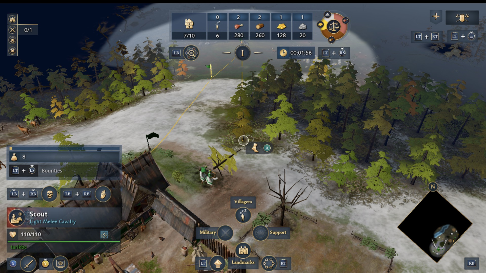
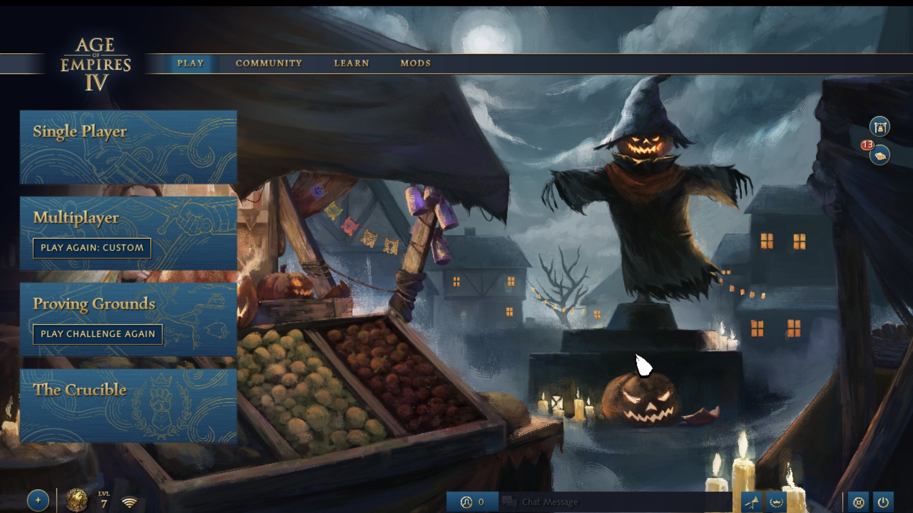
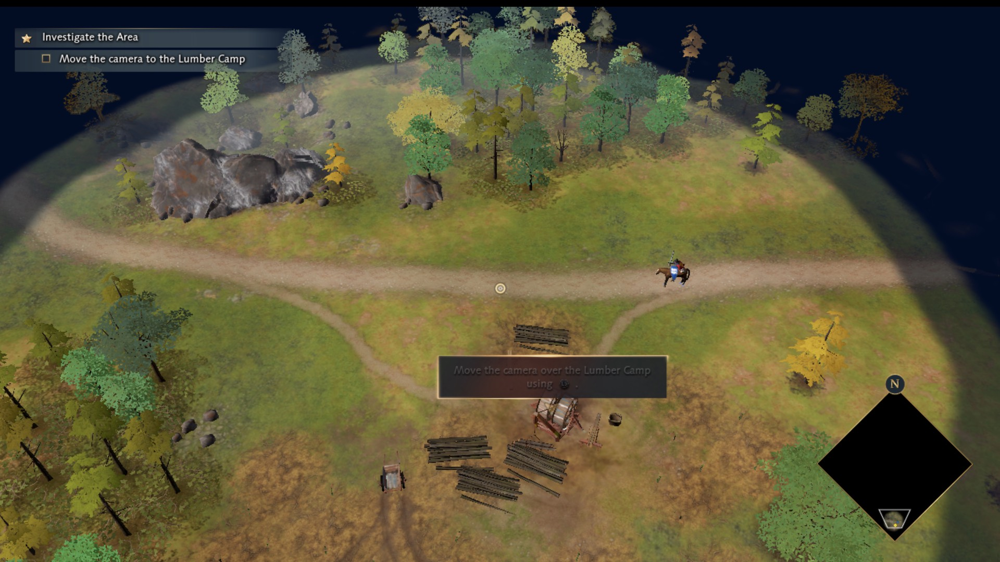
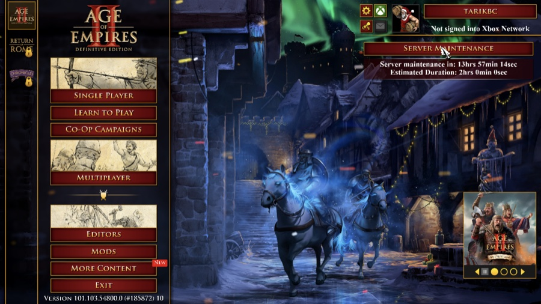
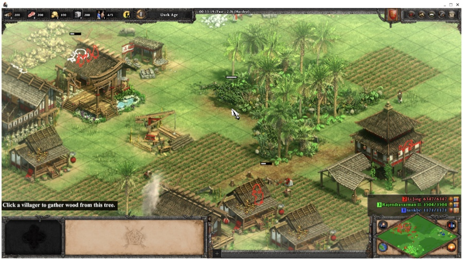
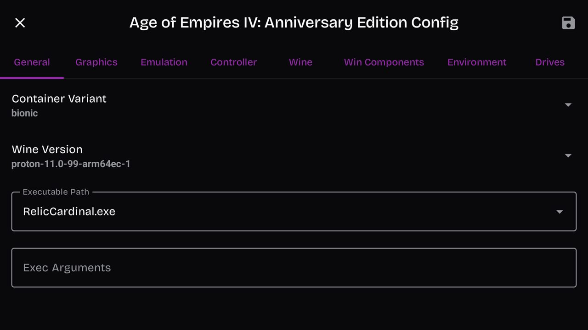
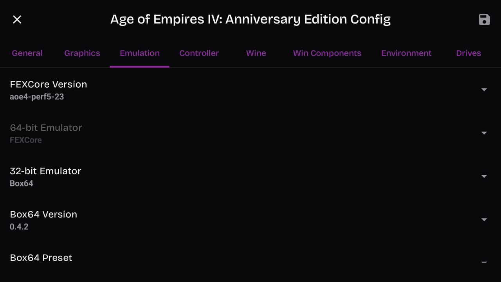
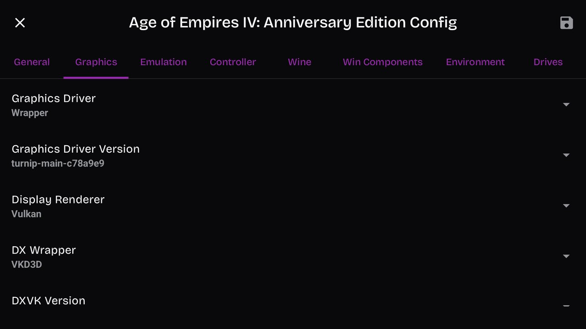
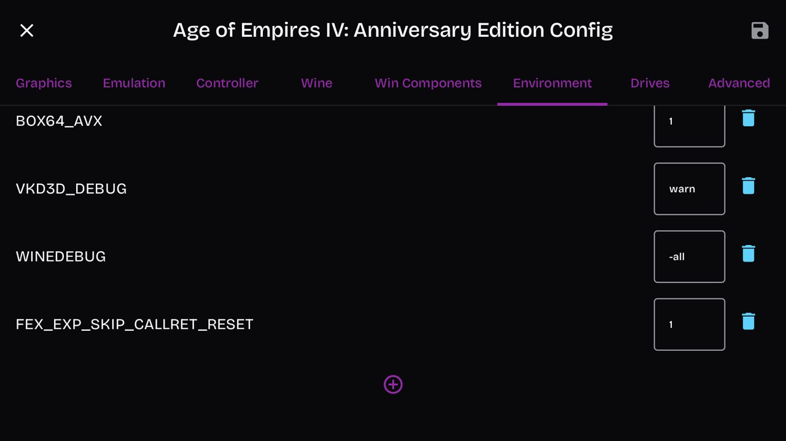
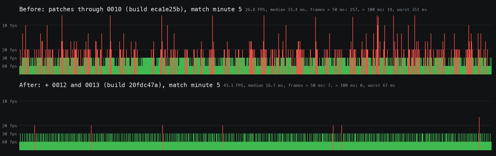

# Age of Empires on Android (GameNative)

Play **Age of Empires IV** and **Age of Empires II: Definitive Edition** on an Android handheld with
[GameNative](https://github.com/utkarshdalal/GameNative). Both games need the patched CPU emulator (FEX) package
from this repo: without it AoE IV's copy protection freezes the game within minutes, and AoE II DE does not start at
all (black screen, it exits after about a second).

| | Age of Empires IV | Age of Empires II: DE |
|---|---|---|
| Plays | A full 51-minute game against one A.I., to victory | A 3-player skirmish against two Hardest A.I.s, 17 minutes, no crash |
| Speed | High 20s to low 30s in a full game; 42 to 46 FPS in the first minutes; **about 39 FPS** in the late-game benchmark (v1.2.0) | **60 FPS** in that skirmish (the game stayed at 60); 27 to 30 FPS in the game's heavy 8-player benchmark |
| Controls | The Thor's controller, with the game's own controller UI | Touch screen as a touchpad, or a mouse (not tried by a player yet) |

| | |
|---|---|
|  |  |
|  |  |

## Status

| | |
|---|---|
| Tested device | AYN Thor (Snapdragon 8 Gen 2, Adreno 740, 16 GB RAM, Android 13) |
| GameNative | 1.2.1 |
| Age of Empires IV | Anniversary Edition (Steam), build 16.3.11308. Main menu, tutorial, skirmish vs the A.I.; a full 51-minute game played to victory. Full game (one A.I., GameNative's FPS counter): high 20s to low 30s, about 24 in big late-game battles. Benchmark (first minutes of a 1v1, 1280×720, display at 120 Hz): 42 to 46 FPS, frames over 100 ms rare (0 to 2 per 90 s). Late-game benchmark (minutes 46 and 48 of that game's replay, v1.2.0, GPU at 680 MHz): 39.0 / 38.6 FPS |
| Age of Empires II: DE | Steam, build 101.103.54800.0, three civilization DLCs, no Enhanced Graphics Pack. Main menu, skirmish vs the A.I.; 59.3 to 60.0 FPS in seven 60 s windows over 17 minutes |
| Not tested | Multiplayer, the campaigns, other devices |

## What you need

- An Android device with a Snapdragon / Adreno GPU and GameNative 1.2.1. Only the AYN Thor was tested; similar
  Snapdragon 8 Gen 2 devices are the most likely to work.
- The game on Steam, installed through GameNative.
- The package `fexcore-aoe4-perf5.wcp` (900 KB) from the
  [latest release](https://github.com/tarikbc/ageofempires-android/releases/latest). Its name starts with `aoe4`
  because it was made for AoE IV first; the same package runs both games.
- For AoE IV: the graphics driver **Turnip v26.2.0 R4** (`Turnio_v26.2.0_R4.zip` from
  [StevenMXZ's release v26.2.0-R4](https://github.com/StevenMXZ/Adreno-Tools-Drivers/releases/tag/v26.2.0-R4)).

## Setup

### 1. Install the patched emulator (and the AoE IV driver)

1. Download [`fexcore-aoe4-perf5.wcp`](https://github.com/tarikbc/ageofempires-android/releases/latest/download/fexcore-aoe4-perf5.wcp)
   (and, for AoE IV, the driver zip) on the device; they land in the Download folder.
2. In GameNative: **Menu → Settings → Contents Manager → Import .wcp from device**, and pick the `.wcp`.
   It shows up under the FEXCore type as `aoe4-perf5 (23)`.
3. For AoE IV: **Menu → Settings → Driver Manager → Import ZIP from device**, and pick the driver zip.

### 2. Age of Empires IV: set up the container

Open the game in GameNative, tap the **cog** next to Play, then **Edit container**. Set:

| Tab | Setting | Value |
|---|---|---|
| General | Container Variant | `bionic` |
| General | Wine Version | `proton-11.0-99-arm64ec-1` (see the note below) |
| General | Executable Path | `RelicCardinal.exe` |
| Graphics | Graphics Driver / Version | `Wrapper` / `Turnip v26.2.0 R4` |
| Graphics | DX Wrapper | `VKD3D` |
| Emulation | 64-bit Emulator | `FEXCore` |
| Emulation | FEXCore Version | **`aoe4-perf5-23`** |
| Environment | add `WINEDEBUG` | `-all` (no Wine debug output, even when GameNative's Wine debug setting is on) |
| Environment | add `FEX_EXP_SKIP_CALLRET_RESET` | `1` (roughly doubles the FPS) |

Then tap **Save** (top right).

| | |
|---|---|
|  |  |
|  |  |

**About the Wine version:** the tested one is listed on the Thor as `proton-11.0-99-arm64ec-1`. It came from a
manual import, and research says it is the same build as GameNative's official `proton-11.0-1-arm64ec`
([details](docs/guides/WINE-SOURCE.md)). The official one was not run directly here; if you try it, please report back.

### 3. Age of Empires II: DE: set up the container

GameNative fills in a "known config" for this game. Keep its graphics settings (`Wrapper`, `turnip_v26.0.0_R6`,
DXVK) and change:

| Tab | Setting | Value |
|---|---|---|
| General | Wine Version | `proton-11.0-99-arm64ec-1` |
| General | Exec Arguments | `SKIPINTRO` |
| Emulation | FEXCore Version | **`aoe4-perf5-23`** |
| Environment | add `FEX_TSOENABLED` | `0` (about 30 % more FPS in big battles; remove it if the game crashes) |
| Environment | add `FEX_EXP_SKIP_CALLRET_RESET` | `1` |
| Environment | add `WINEDEBUG` | `-all` |

Before the tested setup, the game's own VC++ 2022 runtime was installed into the container (GameNative 1.2.1 skips
it); whether that is still needed was not tested. Details: [AOE2-DE.md](docs/guides/AOE2-DE.md).

### 4. Recommended device settings

- **Display at 120 Hz** (the Thor's refresh-rate tile). Set it **before** starting the game. At 60 Hz a frame
  that misses a refresh waits a whole extra 16.7 ms; at 120 Hz long frames almost disappear.
- **AoE IV controller:** turn on the game's controller mode: in the game, Settings → Controls → input **Gamepad**.
  The game closes itself once after that switch; start it again. The Thor's controller works in its standard mode,
  with no button remapping.
- **Power:** GameNative's Power Control sets the CPU and GPU limits for the game's container at every start. The
  CPU needs its full clocks: with the cores capped at about 2 GHz AoE IV's late game ran at 27.8 FPS instead of 36.
  Hold the GPU at its top level too (in Power Control, GPU minimum and maximum both at the top), which gave about
  2 FPS more in AoE IV's late game. We set these in the container's profile file; [TUNING.md](docs/guides/TUNING.md)
  has the values and the measurements.

### 5. Play

Tap Play. The first start takes a few minutes. In AoE IV a press of the A button skips each intro film and the title
screen.

## What to expect

### Age of Empires IV

*One bar per frame (higher is slower). Top: the earlier package, about 27 FPS with frequent stutters. Bottom: this
package, about 43 FPS and almost no long frames.*

Measured with an automated 1v1 skirmish (camera turning, 90 s windows, the game's frame times from Android's
compositor):

| | FPS | median frame | frames over 100 ms |
|---|---|---|---|
| Earlier package (protection fixes only), 60 Hz | 26.0 to 26.7 | 33.4 ms | 71 to 83 per 90 s |
| **This package**, display at 60 Hz | 42.0 to 43.7 | 16.7 ms | 0 to 2 |
| **This package**, display at 120 Hz | 42 to 46 | 25.3 ms | 0 to 2 |

These were measured with v1.0.0. v1.1.0 gave the same numbers as v1.0.0 in a back-to-back test
([TUNING.md](docs/guides/TUNING.md)).

The benchmark measures the first minutes of a 1v1 in which the player does nothing. A real game is heavier: in a
full 51-minute game against one A.I. (Intermediate) the FPS counter read high 20s to low 30s, and about 24 in the big
late-game battles (v1.1.0).

**Late game.** That game's replay is the late-game benchmark: two 90 s windows at minutes 46 and 48, the player's
own camera, the CPU at full clocks ([TESTING.md](docs/guides/TESTING.md)):

| | FPS (minute 46 / 48) | frames over 50 ms |
|---|---|---|
| v1.1.0 | 36.0 / 36.2 | 19 / 15 |
| v1.2.0 | 36.7 / 36.5 | 10 / 11 |
| **v1.2.0, GPU held at 680 MHz** | **39.0 / 38.6** | 18 / 22 |

The CPU runs hot in long sessions: the hottest CPU sensor read about 95 °C during the tests (GPU about 77 °C).

### Age of Empires II: DE

| Situation | FPS | frames over 50 ms |
|---|---|---|
| 3-player skirmish (two Hardest A.I.s, Fast speed, map visible), 7 × 60 s over 17 minutes | 59.3 to 60.0 | 0 to 2 per window |
| Same game, camera on an A.I. base in the Imperial Age | 59.9 | 1 |
| The game's Ranked Benchmark Test (8 players, big battles), battle part | 27 to 30 | many; score 1114.8 |

The game did not go above 60 FPS, although the display ran at 120 Hz and the game's own limit was 120. In the
benchmark the game's main thread used 95 % of one core: the emulated CPU work limits it, not the GPU. Hottest CPU
sensor up to 94 °C.

## Known issues

**Age of Empires IV**

- **Do not stay long in GameNative's Quick Menu during a match.** It pauses the game; after a 24 s pause the game
  exited once (a 9 s pause was fine).
- **A "video card's installed driver version" dialog** can block loading after its one-day "Don't show this
  message" choice expires. GameNative's touch input did not reach its button in our tests; the repo's helper
  `tools/probes/dlgclick` clicks it from adb ([RESEARCH-LOG.md](docs/research/RESEARCH-LOG.md), Traps).
- **The game needs AVX.** FEX provides it; hiding it makes the game refuse to start.
- **Sometimes it stops while loading** with "Failed to wait for DX12 fence (error 102)" in its log (three times on
  2026-10-08). Start it again; the next start worked each time.
- **Other graphics drivers:** Turnip v26.3.0-R6 ran the same; purple-turnip T30 was about 2.5 FPS slower;
  **Balemuni Apex v2 crashes the game** after about two minutes ([TUNING.md](docs/guides/TUNING.md)).
- **Display mode:** the option stored as `windowmode` 1 gave a black screen; borderless works.
- **End screen "Retrieving...":** after the 51-minute game the result panel said "Waiting to retrieve match results
  from the server" for minutes. The game was not frozen, and the match then appeared in Match History.
- **GameNative "Save Conflict" dialog:** it asks which save to keep when the local and the cloud save both changed.
  Pick the one from where you played last.

**Age of Empires II: DE**

- **The controller does nothing in the menus**, and GameNative's touch screen moves the cursor like a touchpad.
- **A window frame:** from the second start on, the game showed in a window with a title bar at 1272 × 694; the
  first start was full screen. Not resolved.
- **About every 5 minutes a frame of about 0.8 s**, likely the game's single-player autosave.

## How it works

Both games are Windows x86-64 programs. GameNative runs them with Wine (Windows compatibility) and **FEX**, which
translates x86 code to ARM on the fly. The patches change only the emulator, so it behaves more like Windows; the
games and their protections are not modified.

**Age of Empires IV** ships with Relic's anti-tamper protection, **Aegis**. On a real PC it is invisible, but under
the emulator three things went wrong:

1. **A start-up check failed.** The protection checks that Windows functions are not hooked. Wine's ARM64EC
   build lays out some function stubs (`jmp [addr]`, `FF 25`) in a way that looked like a hook, and the protection
   stopped the game 2 to 3 minutes after the start. **Patch 0007** rewrites those stubs into a form the check
   accepts, in every process that runs x64 code. ([HOOK-CHECK.md](docs/how-it-works/HOOK-CHECK.md); the stubs come
   from Wine's build tools, see [UPSTREAM-WINE-ISSUE.md](docs/research/UPSTREAM-WINE-ISSUE.md))
2. **A watchdog fired.** One protection thread runs a loop that must keep up with a time budget, and it raises
   thousands of exceptions per second. Each exception cost about 230 µs under Wine (a round trip to the
   wineserver), the loop fell behind, and 8 to 13 minutes in the protection froze the game. **Patch 0010** lets
   FEX resume from an exception directly: 2.5 µs. ([WATCHDOG.md](docs/how-it-works/WATCHDOG.md))
3. **It was slow.** The protection runs some code one instruction at a time from a 16 MB scratch buffer. For FEX
   every step was new code: a fault, a cache flush and a recompile, about 16,000 times per second, eating 44 % of
   the game's main thread. **Patches 0012 to 0014** recognise that buffer and reuse translations instead of
   recompiling: 26.7 → 43.7 FPS. ([INSTRUCTION-STEPPER.md](docs/how-it-works/INSTRUCTION-STEPPER.md))

Since v1.2.0, **patch 0016** also answers the game's CPU-speed question from a short cache. The game asks for the MHz
of every core about 45 times per second, and Wine read two files per core for each answer: 11 % of the main thread in
the late game. ([POWER-INFORMATION.md](docs/how-it-works/POWER-INFORMATION.md))

**Age of Empires II: DE** (protected with Arxan) crashed about 1 s after the start with GameNative's own FEX 2512,
inside code it decrypts at run time. Every FEX build from this repo that was tried fixes it. Plain upstream FEX-2610
gets past that crash but exits before the menu, so this repo's patches are still needed; which one was not narrowed
down. ([AOE2-DE.md](docs/guides/AOE2-DE.md))

All patches in the package

All against FEX `7d3090f`, in this order ([patches/fex](patches/fex)):

| Patch | What it does |
|---|---|
| 0004 | Reports the game's own memory protection back to it, while FEX keeps its write traps |
| 0006 | A raw x64 `syscall` returns registers like Windows does |
| 0007 | Rewrites Wine's `FF 25` export stubs, in every process that runs x64 code, so the protection's hook check passes |
| 0009 | Skips a costly per-fault reset (on only with `FEX_EXP_SKIP_CALLRET_RESET=1`; about twice the FPS) |
| 0010 | Resumes x64 code after an exception without a wineserver round trip |
| 0012 | Handles the protection's one-instruction-at-a-time buffer without faults and recompiles |
| 0013 | Larger code buffer (512 MB), so FEX clears its whole cache less often |
| 0014 | Reuses compiled code when the protection decrypts the same code again |
| 0015 | Fixes a FEX bug: a 32-bit value was loaded as 64 bits (it also broke the build without 0002) |
| 0016 | Answers the game's per-frame CPU-speed query from a 250 ms cache (v1.2.0) |

Since v1.1.0 the package leaves out patch 0002, which hid FEX's name from the game: the game runs the same without
it, so the package hides less. v1.0.0 had 0002, and 0007 only in the game's process. The package's DLL is
`libarm64ecfex.dll`, SHA-1 `b5e6e357` (v1.2.0; v1.1.0 was `bc82c565`). To build it yourself:
[BUILDING-FEX.md](docs/guides/BUILDING-FEX.md) and [`tools/make_fex_wcp.py`](tools/make_fex_wcp.py).

For contributors: testing without touching the device

The speed work was measured from a Mac over adb: [`tools/bench.py`](tools/bench.py) starts AoE IV, skips the
intros, starts a skirmish with the camera turning (controller input written to the Thor's input device) and records
frame times from Android's compositor, with temperatures; [`tools/fpsgraph.py`](tools/fpsgraph.py) shows a live
frame-time graph in a browser; [`tools/agent.py`](tools/agent.py) reads memory and threads inside the game without
console windows. See [TESTING.md](docs/guides/TESTING.md).

## The whole story

Getting here took a long investigation: what AoE IV's protection checks, what was ruled out, and every measurement.
Start at the [docs index](docs/README.md), or read the full [research log](docs/research/RESEARCH-LOG.md) (the
former README).

| Folder | What is in it |
|---|---|
| [`docs/how-it-works/`](docs/how-it-works) | One write-up per problem the patches fix, and the protection itself |
| [`docs/guides/`](docs/guides) | Tuning, testing over adb, building FEX, driving GameNative, AoE II DE |
| [`docs/research/`](docs/research) | The research log, the dead ends, and redacted raw run data |
| [`patches/fex/`](patches/fex) | The FEX patches in the package |
| [`patches/experiments/`](patches/experiments) | Earlier Box64, Wine and GameNative patches that are not needed |
| [`tools/`](tools) | Test, install and build scripts ([list](tools/README.md)); one-off scripts in `tools/research` |

The package is on the [releases page](https://github.com/tarikbc/ageofempires-android/releases). Older `.wcp` builds
from the investigation do not run the game; they are only in the git history. This repo was called `aoe4-gamenative`
until 2026-10-08; old links redirect here.

## Credits and license

Built on [GameNative](https://github.com/utkarshdalal/GameNative), [FEX-Emu](https://github.com/FEX-Emu/FEX),
Wine and Valve's Proton (via [GameNative/proton-wine](https://github.com/GameNative/proton-wine)), and Mesa's Turnip
driver.

Tools and scripts are MIT (see [LICENSE](LICENSE)). Patches follow their project: FEX MIT, Box64 MIT, Wine
LGPL-2.1-or-later, GameNative GPL-3.0. You need your own copy of the game.

Age of Empires is a trademark of Microsoft. Not affiliated with Microsoft, Relic, World's Edge, AYN or GameNative.
