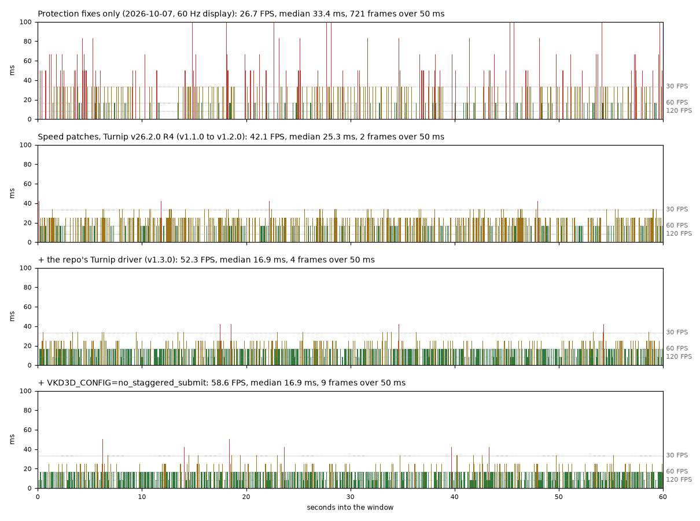

# The story: from a frozen game to 58 FPS

Age of Empires IV on an AYN Thor (Snapdragon 8 Gen 2), through GameNative, in about three days of work from
2026-10-05 to 2026-10-09. At the start the game's copy protection stopped it a few minutes after launch, in every run.
At the end the automated benchmarks read about 58 FPS in the opening minutes of a skirmish and 47 in the late game of
a 51-minute match. This page tells how, in order, and links to the write-up behind each step. Times are local
(UTC−3).

*One bar per frame (higher is slower), the same 60 s of the automated skirmish at five steps: the protection fixes
alone (60 Hz display), the speed patches with the Turnip R4 driver, the repo's Turnip driver, the vkd3d-proton
setting, and patch 0017 (measured after a change to the benchmark's thermal sampler).*

## At a glance

| When | Step | Skirmish FPS | Late game FPS |
|---|---|---|---|
| until 2026-10-06 | Stock GameNative and FEX: the game loads, sometimes to its menu, then the protection stops it 2 to 3.5 minutes after start | - | - |
| 2026-10-07 07:37 | Patches 0007 + 0009: past the old stop, the game finishes loading to its first-run screen; frozen about 13 minutes in | - | - |
| 2026-10-07 09:42 | + patch 0010: **playable**, a skirmish 15 minutes in | about 25 on the HUD | - |
| 2026-10-07 11:17 | Build `eca1e25b`, 0010 on by default (60 Hz display) | 26.7 / 26.6 | - |
| 2026-10-07 14:52 | + patches 0012, 0013: the instruction stepper (60 Hz) | 43.7 / 43.2 | - |
| 2026-10-07 20:44 | **v1.0.0**: + 0014, display at 120 Hz | 45.6 / 45.3 (cool Thor), 42.1 (hot) | - |
| 2026-10-07 22:20 | **v1.1.0**: less hiding (0002 out), 0015 | 41.3 / 40.7 (hot), same as v1.0.0 | 36.0 / 36.2 |
| 2026-10-08 03:26 | **v1.2.0**: + 0016, GPU held at 680 MHz | 41.0 / 41.1 | 39.0 / 38.6 |
| 2026-10-08 13:27 | **v1.3.0**: Turnip built from Mesa main | **52.3 / 52.3** | **46.1** |
| 2026-10-08 16:30 | + `VKD3D_CONFIG=no_staggered_submit` | **58.6 / 58.1** | 47.3 and 48.5, less even |
| 2026-10-09 02:49 | **v1.4.0**: + 0017 | 58.3 / 57.8 against 56.4 / 56.3 for v1.3.0 + vkd3d in the same session | not measured |
| 2026-10-09 15:45 | **v1.5.0**: driver patch for colour compression, two variables | 60.1 / 59.6 against 58.1 / 58.6, alternating (GameNative 1.3.0) | not measured |

Skirmish: an automated 1v1 with the camera turning, FPS from Android's compositor in 90 s windows at two match
minutes ([TESTING.md](guides/TESTING.md)). Late game: the replay of a full 51-minute game, minutes 46 and 48. Numbers
from different days are only roughly comparable (display rate, heat, and a change of the benchmark's thermal sampler
on 2026-10-09; [PERFORMANCE.md](research/PERFORMANCE.md) explains each). Releases and files:
[CHANGELOG.md](../CHANGELOG.md).

## 1. The game stops (2026-10-05 and 06)

The first sessions tried two routes. **x86-64 Wine under Box64** needed a Box64 fix for its SSE/AVX store decoder
(write faults reached Wine as reads) and was then about six times slower than the same game under Rosetta on a Mac,
so the work moved to **ARM64EC Wine with FEX**, GameNative's newer route. Two other fixes came on the way: the
Direct3D 12 game needs the VKD3D wrapper, and GameNative wrote a stale Steam ticket on later launches (Bionic Steam
mode avoids it). Then the game started, rendered, reached its menu, logged in, and froze 2 to 4.5 minutes after
launch. (Offline it exited after about 35 s in its network start-up, a different failure.)

The freeze turned out to be deliberate. One thread of the game's anti-tamper protection, **Aegis**, suspended every
other thread ([AEGIS.md](how-it-works/AEGIS.md)). The repo started on 2026-10-06 at 06:46, and that day went through
one lead after another; each is in the [archive](research/archive):

- FEX shows its name in CPUID leaf `0x40000000`. Hidden by patch 0002, verified live: the game still stopped.
- FEX's self-modifying-code trap is visible through `NtQueryVirtualMemory`. Real, and hidden by patch 0004 without
  turning the trap off (turning it off stops the game at start-up), but the game was still stopped in 5 of 5 runs
  ([SMC-TRAP.md](how-it-works/SMC-TRAP.md)).
- The game's backend session and Wine's TLS, and loaded module names that Windows does not have: ruled out. Binary
  patches to Wine's ntdll: void, because Wine never loaded them.

What made progress possible were the methods, not the leads: a **clean baseline** (leftover Wine debug channels had
slowed every evening run), a **single success criterion** (the game's own log still growing after five minutes, since
a suspended process still shows in `ps`), and a probe that reads suspend counts without suspending anything
(`suspinfo`). On that baseline the stop came 2 min 3 s to 3 min 32 s after the start in the judged runs of that night;
two of them exited instead of hanging ([KILL-REMEASURED.md](research/archive/KILL-REMEASURED.md),
[SMC-TRAP.md](how-it-works/SMC-TRAP.md), part 3). In the early hours of 2026-10-07 a `WINEDEBUG=+seh` trace showed
the kill thread was a timed job, set up at start-up ([KILL-TIMER.md](research/archive/KILL-TIMER.md)).

## 2. Why it stops, and the fixes (2026-10-07 morning)

- **Patch 0006** made a raw x64 `syscall` return registers the way Windows does. Correct, and not the trigger.
- **The start-up check (patch 0007).** A FEX build that dumps the decrypted code it compiles (patch 0008) showed what
  the timed job decides on: an inline-hook check of 63 Windows API functions. Wine's ARM64EC kernel32 exports 27 of
  them as a bare `jmp [rip+x]` (`FF 25`), which looks like a hook. Patch 0007 rewrites those stubs to `48 FF 25`. The
  game then got past the old stop, and was stopped 8 to 10 minutes in instead
  ([HOOK-CHECK.md](how-it-works/HOOK-CHECK.md)).
- **The watchdog (patches 0009 and 0010).** One protection thread runs a loop with a 2 s budget per cycle and fails
  when the accumulated lateness passes 256 s. Under FEX a cycle took 2.2 to 5.8 s. With patch 0009 (an unsafe
  experiment that skips a per-fault reset, still on behind a switch) the game finished loading and drew its first-run
  screen at 07:37. The real cost was one wineserver round trip per handled exception, thousands per second, in Wine's
  ARM64EC `NtContinue` path; **patch 0010** resumes x64 code without it. At 09:42 a skirmish ran 15 minutes in:
  **the game was playable** ([WATCHDOG.md](how-it-works/WATCHDOG.md)).

The game and its protection are not modified: the patches change how the emulator behaves, so it looks more like
Windows.

## 3. Making it fast (2026-10-07 afternoon and evening)

Playable meant about 26 FPS. The protection runs some code one instruction at a time, copying each instruction into a
slot of a 16 MB buffer and jumping there. For FEX every step was new code: a write fault, a cache flush and a
recompile, about 16,000 times per second, 44 % of the main thread. **Patches 0012 and 0013** recognise that buffer
and reuse translations: 26.7 → 43.7 FPS. **Patch 0014** reuses compiled code when the same code is decrypted again,
which removed the periodic full recompile ([INSTRUCTION-STEPPER.md](how-it-works/INSTRUCTION-STEPPER.md)).

Then the settings ([TUNING.md](guides/TUNING.md)): the display at **120 Hz** (at 60 Hz a frame that missed a refresh
waited 16.7 ms more), the CPU allowed to scale, and a comparison of the Turnip drivers in circulation (R4 and R6 the
same, others slower or crashing). **v1.0.0** was released at 20:44, and the docs were split into player and
research parts. **v1.1.0** at 22:20 dropped patch 0002 (the game runs the same without hiding FEX's name), applied
0007 in every process, and added **patch 0015**, a FEX bug fix. The user then played a full 51-minute game against
one A.I. to victory; the FPS counter read high 20s to low 30s, about 24 in the big battles.

## 4. The late game (2026-10-07 night to 2026-10-08 morning)

The replay of that game became the **late-game benchmark** (`tools/replay.py`). Its first windows at minutes 46 and 48
read 27.8 FPS, because a Thor setting capped the big cores near 1.9 GHz; at full clocks the same windows read 36.0.
Sampling the main thread found Wine reading two cpufreq files per core, about 45 times per second, for the game's
CPU-speed query; **patch 0016** answers from a 250 ms cache ([POWER-INFORMATION.md](how-it-works/POWER-INFORMATION.md)).
Holding the GPU at 680 MHz added about 2 FPS in the late game. **v1.2.0** at 03:26: 39.0 / 38.6 FPS.

Less than two hours later **Age of Empires II: DE** ran too: it crashed a second after start with GameNative's own FEX,
and every FEX build from this repo fixes that. A 3-player skirmish runs at 59 to 60 FPS; the game did not go above 60,
although its own limit was 120 ([AOE2-DE.md](guides/AOE2-DE.md)).

Profiles of the late game ([PERFORMANCE.md](research/PERFORMANCE.md)) showed no single hot spot left on the CPU:
TSO off and thread pinning changed nothing, and the render thread waited about 10 ms per frame for the game's own
GPU fence. The GPU was the next place to look.

## 5. The graphics stack (2026-10-08)

- **The driver (v1.3.0).** The Turnip builds in circulation waited for the GPU on every fence check with a zero
  timeout, because the Qualcomm kernel driver reads zero as "wait forever"; vkd3d-proton checks fences on every
  submit, so CPU and GPU ran in lock step. Mesa fixed that on 2026-10-08 (merge request !44838), and a Turnip built
  from Mesa main the same day gave **41 → 52.3 FPS** in the skirmish and 39 → 46.1 in the late game
  ([GPU-DRIVER.md](how-it-works/GPU-DRIVER.md)).
- **vkd3d-proton's submissions.** GPU traces then showed long idle gaps between command buffers, and the vkd3d queue
  thread waiting on the CPU most of the time: Turnip has one Vulkan queue, and vkd3d-proton 2.14.1 then keeps only one
  command buffer in flight. `VKD3D_CONFIG=no_staggered_submit` turns that off: **52.3 → 58.6 FPS**. In the late game
  it gains only 1 to 2 FPS and makes frame times less even; the user kept it
  ([VKD3D-SUBMIT.md](how-it-works/VKD3D-SUBMIT.md)).

The driver options tried on top gave no gain: one other autotune mode, an LRZ switch, a merge request, a second queue
and a change to the submit path; forced tile rendering got no clean run ([TUNING.md](guides/TUNING.md), "Measured and
not kept").

## 6. The stutters (2026-10-08 evening to 2026-10-09)

At 58 FPS a few frames per minute still took 42 or 51 ms. A scheduler trace on the display's clock split them into two
kinds: bursts of the game's own job system (the main and render threads waiting for 8 worker threads that each run
several times longer in those frames), and frames with a normal game cadence that reached GameNative late. A later
trace put that delay on the game's own Vulkan present thread waiting for the GPU; GameNative itself adds about
0.1 ms. FEX, the CPU clocks and other apps were ruled out ([PERFORMANCE.md](research/PERFORMANCE.md), "the hitches at
58 FPS" and "settings tried around patch 0017").

Instruction-pointer samples then found 13.7 % of the main thread at one of the protection's exception handlers: the
protection raises about 44,000 illegal-instruction exceptions per second, and each went through a host trap and two
passes through the exception dispatcher. **Patch 0017** raises them directly: about +1.5 FPS and a fifth fewer 25 ms
frames, released as **v1.4.0** at 02:49 ([TRAPLESS-FAULTS.md](how-it-works/TRAPLESS-FAULTS.md)). The rarer long
frames stayed within their spread.

## 7. The GPU's memory traffic (2026-10-09)

With the GPU the limit, the driver became the place to look. A code reading of Turnip and of the GPU traces ranked the
leads; the device then answered them one by one ([PERFORMANCE.md](research/PERFORMANCE.md), "driver tests on
GameNative 1.3.0"). LRZ (early depth culling), anisotropic filtering and a slow software-float path cost nothing in
this frame. Compression did: turning UBWC off everywhere cost 5 %, and Turnip's own log showed that the game's
largest colour images had none, because vkd3d-proton lists formats for them that the A740 cannot share compressed
data with. A driver build that logged every incompatible view showed which of those formats the game really uses;
the two cases it never uses now keep UBWC behind two variables: +1.5 FPS (+2.6 %), released as **v1.5.0**
([UBWC.md](how-it-works/UBWC.md)).

That day the Thor also moved to GameNative's 1.3.0 test release, for GTA V, and AoE IV ran on it as before.

## The FEX packages

The main FEX builds along the way, with the DLL's SHA-1. Released packages are in bold.

| Content (name-code) | DLL | What it adds | Result |
|---|---|---|---|
| `2610-aoe-1` | `6f5f25f6` | own build of FEX `7d3090f`, unpatched | stopped 2 to 3 minutes in |
| `2610-aoe-nofex2-3` | `460568b8` | CPUID hex patch under both DLL names | the baseline of the 2026-10-06 runs; stopped |
| hand-installed | `b4dbf32d` | 0001 + 0003, SMC trap off | stops at start-up |
| hand-installed | `4bc9d3a9` | 0002 (the control of the 0004 runs) | stopped in 2 of 3 runs, the third exited |
| hand-installed | `2f578905`, `a5ec2726` | + 0004, then 0004's final form | stopped in 5 of 5 runs |
| hand-installed | `d6adae8a` | + 0006 | stopped in 3 of 3 runs |
| `aoe-fastcontinue-10` | `86d6da39` | 0002, 0004, 0006, 0007, 0009, 0010 | the first playable build: validated at 10:00 as a hand-installed DLL, imported as this package at 10:34 (2026-10-07) |
| `aoe-fastcontinue2-11` | `eca1e25b` | the same, 0010 on by default | 26.7 FPS (60 Hz) |
| `aoe4-perf-18` | `20fdc47a` | + 0012, 0013 | 43.7 FPS (60 Hz) |
| **`aoe4-perf2-20`** (v1.0.0) | `6990a221` | + 0014 | 43.3 (60 Hz), 45.6 (120 Hz) |
| **`aoe4-perf3-21`** (v1.1.0) | `bc82c565` | − 0002, 0007 in every process, + 0015 | same speed |
| `aoe4-perf4-22` | | a first 0016 build | froze at start, removed |
| **`aoe4-perf5-23`** (v1.2.0, v1.3.0; AoE II DE) | `b5e6e357` | + 0016 | late game +0.7 / +0.3 FPS |
| **`aoe4-perf6-30`** (v1.4.0) | `7e707379` | + 0017 | +1.5 FPS |

The patch files and their status: [patches/fex](../patches/fex).

## What is left

**Not tested:** multiplayer, the campaigns, other devices; a full game by a person on the repo's driver; the late
game with patch 0017; AoE II DE on `aoe4-perf6-30` or on the repo's driver; patch 0009's gain on the current package;
AoE IV on GameNative 1.3.0, which the Thor runs since 2026-10-09 ([LOG.md](research/LOG.md), "2026-10-09").

**Open leads for more FPS.** In the skirmish the GPU is the likely limit: the kernel reports it busy about 95 % of the
time at its top clock (clock-on time, not work), and the CPU-side tests changed nothing. Still open on the GPU side: a
GPU trace without the tracing build's own stalls (`one_time_submit`) to find the most expensive shaders, fewer render
passes for the main scene (vkd3d-proton splits it into about six passes that each load and store the same images),
and the clean fix for the compression case in vkd3d-proton ([UBWC.md](how-it-works/UBWC.md)). In the late game the main and render threads sometimes wait on the small
cores; keeping them on the big cores was not tested with the vkd3d-proton setting.

**Upstream:** the fixes that belong in FEX or Wine were reported on 2026-10-08; patch 0017 is not reported yet. The
driver's gain is Mesa's own merge request !44838 ([UPSTREAM.md](research/UPSTREAM.md)).

## Lessons

- **Alive is not working.** A suspended game still shows in `ps`; judge a run by its own log.
- **Clean the baseline first.** Leftover debug channels made a whole evening of runs misleading.
- **"GPU busy" is clock-on time, not work.** And a tracing driver changes what it measures.
- **Compare only inside one session.** Heat, the display rate and changes to the benchmark itself moved results
  between days.
- **Read the source when a guess fails.** The intent key (`appid`), the KGSL zero-timeout wait and vkd3d-proton's
  staggered submissions were all found in code, after guessing had failed.
